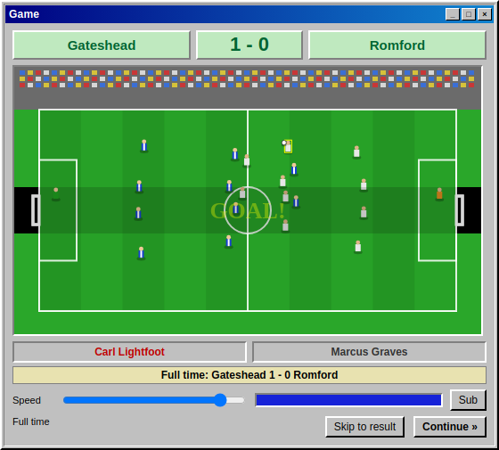
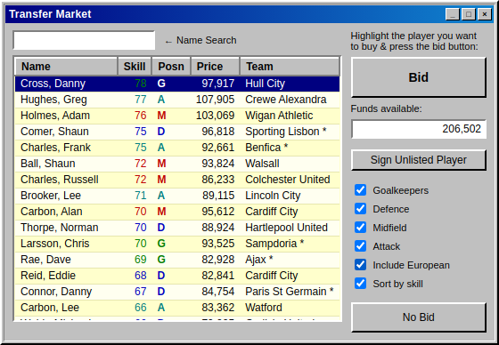
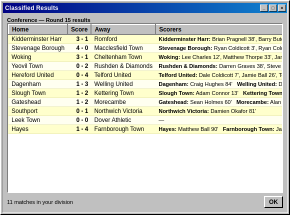
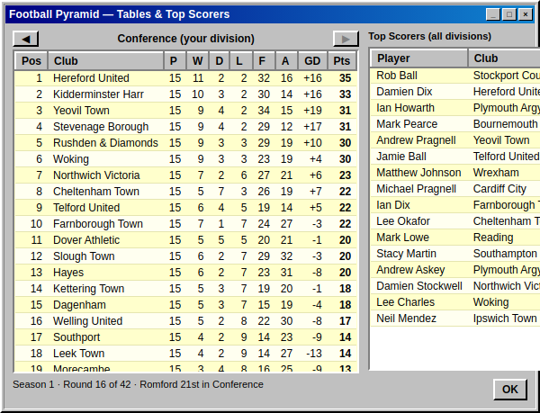
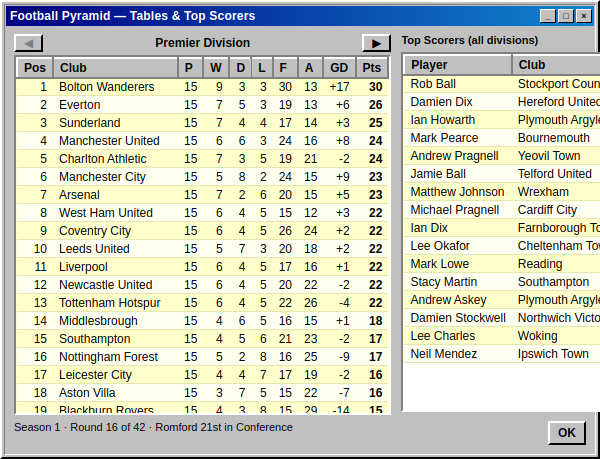

# SIMSOC 6 — remake

A faithful, **from-scratch browser recreation** of the classic late-90s football
management game *SIMSOC 6*. You take charge of a club in the **Conference** (the
bottom of a four-division pyramid), pick your squad, work the open transfer
market, watch your matches play out in the automated side-on match engine, and
try to win **promotion all the way up to the Premier Division** — exactly the
"work your way up" loop the original was loved for.

It runs with **zero runtime dependencies** — plain HTML, CSS and JavaScript.

> This is an independent, clean-room homage built only from publicly visible
> screenshots and descriptions of the game. It contains **no original code or
> assets** — every player, club and fixture is generated by the code in this
> repo. Not affiliated with or endorsed by the makers of SIMSOC.

## Screens

| Choose your club | Squad |
|---|---|
|  |  |

| Team Selector | Match engine |
|---|---|
|  |  |

| Transfer Market | Classified results |
|---|---|
|  |  |

| League tables — your division | …and the division above |
|---|---|
|  |  |

## Features

- **Choose your club** — at kick-off you take charge of any of the 22
  Conference clubs, each with its own squad strength, prospects (title
  favourites → relegation battle) and finances. Pick one or hit Random Club.
- **Squad management** — full roster with position colour-coding (G/D/M/A),
  per-season and career Apps/Goals, editable player names, a Player Analysis
  readout, transfer-listing to sell, and a live Manager Rating %.
- **Team selector** — pick 11 starters + subs from your reserves, with live
  **Defence / Midfield / Attack / Morale** ratings for you and the opponent
  (morale tracks recent form). "Pick Best XI" and "Clear Selection" helpers.
- **Automated match engine** — a canvas side-view match with mown pitch, crowd,
  goalmouths, 22 sprite players and the ball, a 0–90 clock, on-ball commentary
  names, adjustable **Speed**, in-match **Subs**, and "Skip to result". The
  scoreline and goal timeline are pre-simulated by the engine so the league
  stays consistent — just like the original "fully automated" matches.
- **Open transfer market** — players from English & European clubs, filter by
  position / European / sort by skill, name search, **Bid** within your budget,
  and **Sign Unlisted Player**.
- **A four-division pyramid** — 88 clubs across Premier Division, Division One,
  Division Two and the Conference. **All divisions are simulated every round**,
  with **promotion and relegation** (top/bottom three swap) at season's end, so
  you climb — or slide — between tiers. Bigger divisions pay bigger gate receipts.
- **League tables for every division** — browse any tier, with **top scorers
  across all leagues**, plus a **Classified Results** screen listing a full
  round of fixtures with the scorers for every club.
- **A real season** — a balanced 42-game home/away fixture list, gate receipts,
  manager rating, and automatic season rollover.
- **Autosave** to `localStorage`, so your game is there when you come back.

## Run it

No build step. Pick either:

```bash
# 1) tiny built-in static server (recommended)
npm start            # then open http://localhost:8080

# 2) or just open the file
#    open index.html in any modern browser
```

Useful URL params: `?fresh=1` starts a new game ignoring the save;
`?seed=12345` seeds the world deterministically; `?club=66` jumps straight in
as that club by global index (0–87), skipping the chooser.

## Develop / verify

```bash
npm test             # head-less engine self-test (season sim, table maths, transfers, save/load)
npm run shots        # drives the game in headless Chrome and writes shots/*.png
```

`npm test` needs nothing but Node. `npm run shots` uses Puppeteer
(a dev-only dependency) to capture the screenshots above.

## How it's put together

```
index.html        all seven windows (Choose Club, Squad, Team Selector, Game,
                  Transfer, League tables, Classified Results)
css/style.css     Windows 9x styling (3D widgets, title bars, data grids)
js/data.js        seeded RNG, name pools, division/club/squad generation    (UMD)
js/engine.js      division pyramid, fixtures, ratings, match sim, transfers,
                  promotion/relegation, season loop                          (UMD)
js/match.js       canvas match animation (plays out the engine's timeline)
js/ui.js          screen rendering, input handling, wiring
server.js         zero-dependency static file server
test/run.js       head-less engine self-test (51 checks)
tools/screenshots.js   Puppeteer screenshot capture
```

`data.js` and `engine.js` are written as UMD modules, so the exact same game
logic runs both in the browser and under Node for the test harness.

## Credit

Inspired by *SIMSOC 6* (1998). Reference:
[Retro Review: Simsoc 6 — Fuller FM](https://fullerfm.com/2025/04/30/retro-review-simsoc-6/)
and the [MobyGames entry](https://www.mobygames.com/game/205760/simsoc-6/).

MIT licensed.
