# SIMSOC 6 — remake

A faithful, **from-scratch browser recreation** of the classic late-90s football
management game *SIMSOC 6*. You take charge of a club in the **Conference** (the
bottom of a four-division pyramid), pick your squad, work the open transfer
market, watch your matches play out in the automated side-on match engine, and
try to win **promotion all the way up to the Premier Division** — exactly the
"work your way up" loop the original was loved for.

It runs with **zero runtime dependencies** — plain HTML, CSS and JavaScript.

> This is an independent, clean-room homage built only from publicly visible
> screenshots and descriptions of the game. It contains **no original code or
> assets** — every player, club and fixture is generated by the code in this
> repo. Not affiliated with or endorsed by the makers of SIMSOC.

## Screens

| Choose your club | Squad |
|---|---|
| 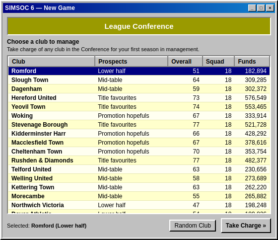 | 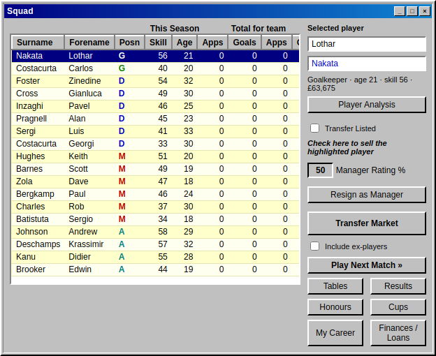 |

| Team selector (league or cup) | Match engine with live box score |
|---|---|
| 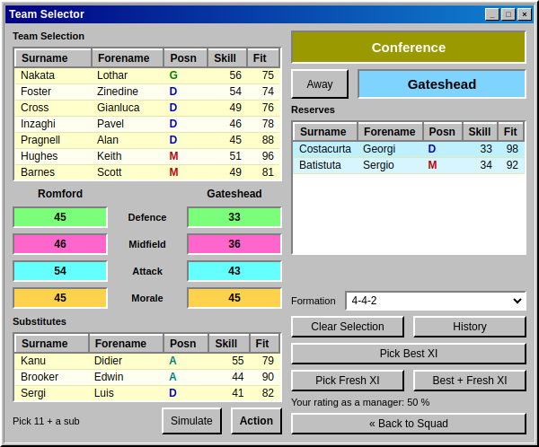 | 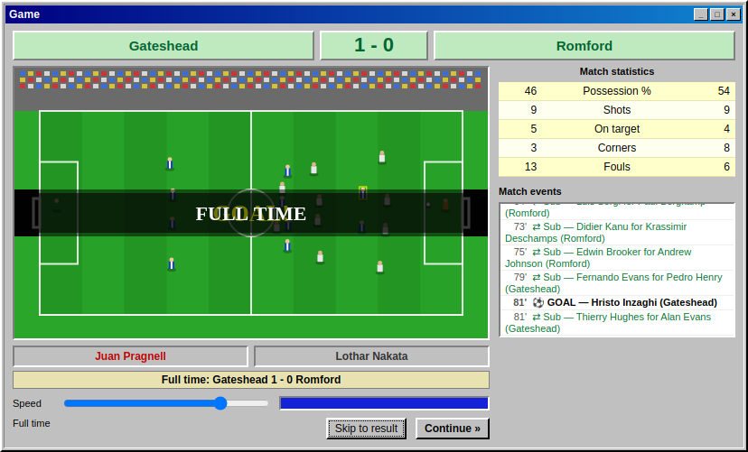 |

| Results round-up | Transfer market |
|---|---|
| 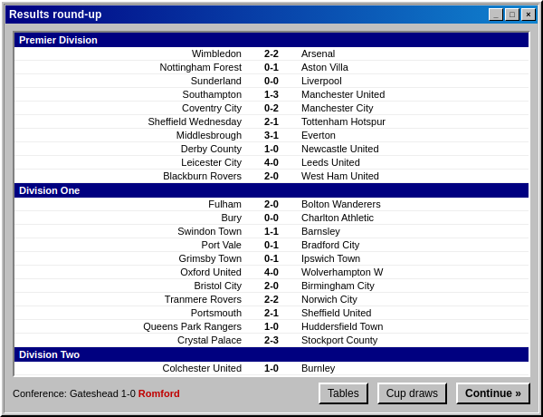 | 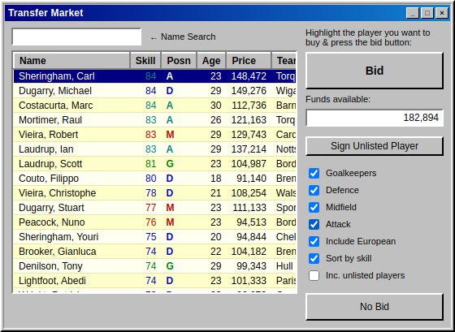 |

| League tables (any division) | Classified results |
|---|---|
| 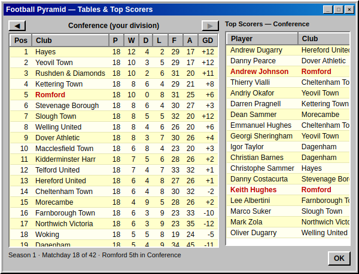 | 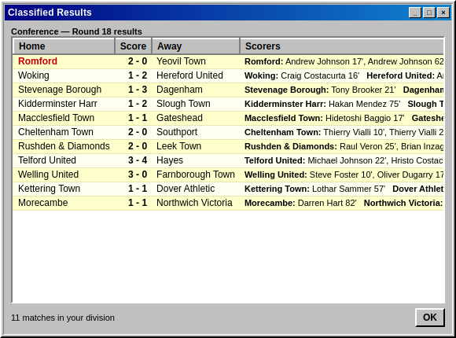 |

| Cup draws & brackets | A cup tie |
|---|---|
| 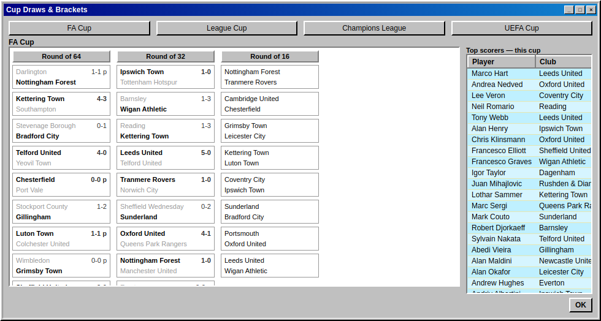 | 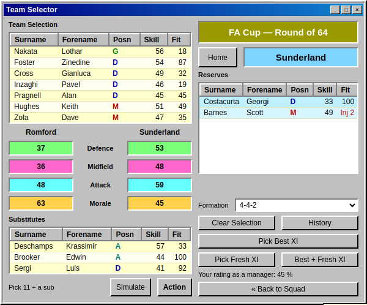 |

| Head-to-head record | Finances & loans |
|---|---|
| 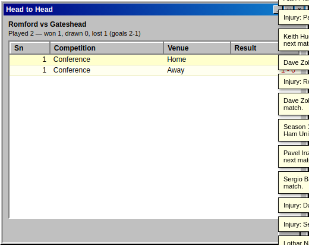 | 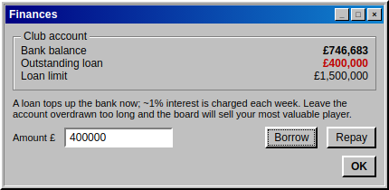 |

| Roll of honour | My career |
|---|---|
| 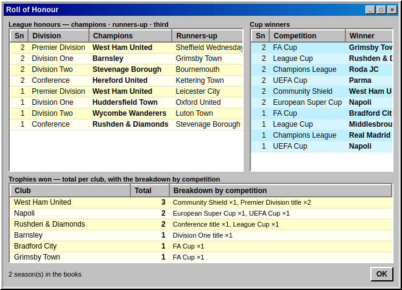 | 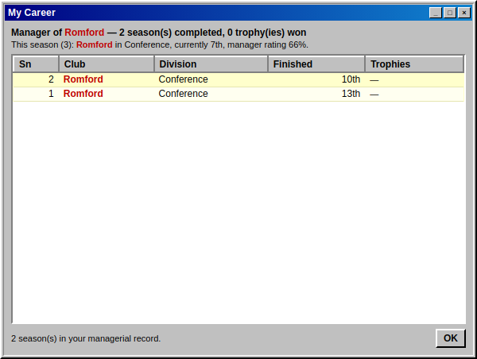 |

| The desktop |
|---|
| 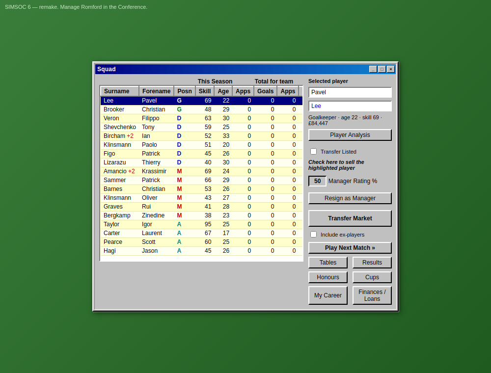 |

## Features

- **Choose your club** — at kick-off you take charge of any of the 22
  Conference clubs, each with its own squad strength, prospects (title
  favourites → relegation battle) and finances. Pick one or hit Random Club.
- **Squad management** — full roster with position colour-coding (G/D/M/A),
  age, per-season and career Apps/Goals, a Player Analysis readout,
  transfer-listing to sell, and a live Manager Rating %.
- **Team selector** — pick 11 starters + subs from your reserves, with live
  **Defence / Midfield / Attack / Morale** ratings for you and the opponent
  (morale tracks recent form). Choose a **formation** (3-4-3, 3-5-2, 4-4-2,
  4-5-1, 5-4-1) and let the auto-pickers fill it: **Pick Best XI** (quality
  first), **Pick Fresh XI** (freshest legs, for rotation) or **Best + Fresh XI**
  (a blend), plus **Clear Selection**. Squads are capped at **23 players**;
  injured **and suspended** players are flagged as unavailable. Turn up with
  **fewer than 8 fit players and the match is forfeited** (a 0–3 walkover).
- **Automated match engine** — a canvas side-view match with mown pitch, crowd,
  goalmouths, 22 sprite players and the ball, a 0–90 clock and on-ball commentary.
  A live **box score** sits alongside (possession, shots, on target, corners,
  fouls) with a rolling **match-events tabellino**: every **GOAL**, **booking**
  (yellows and reds), **injury** and **automatic substitution**. Adjustable
  **Speed** and "Skip to result"; the animation **freezes at full time**. Prefer
  numbers? **Simulate** returns the result instantly without the animation.
- **A dynamic transfer market** — player skill runs **20–99** (with rare 90+
  stars); listings churn through the season. Filter by position / European /
  sort by skill, name search, **Bid** within budget, **Sign Unlisted Player**,
  and tick **Inc. unlisted players** to approach (for a premium) anyone at
  another club. **Selling is instant** — list a player and the fee is banked now.
- **Squad development** — players have an **age** (shown everywhere) and their
  skill is **re-rolled each close season** — strongly random, with an age bias so
  youngsters tend to rise and veterans fade. **Injuries** strike during matches
  and cost games to recover, while starting drains **fitness** and resting
  restores it, so **rotation matters**. **Bookings** carry consequences too — a
  red card or **five accumulated yellows** earns a **one-match suspension** —
  giving you another reason to rotate. Player names come from a broad
  **international 90s pool** and are fixed (no renaming).
- **A four-division pyramid** — 86 league clubs: a 20-club **Premier Division**
  above Division One, Division Two and the 22-club Conference. **Every division
  is simulated each round**, with **promotion and relegation** (top/bottom three
  swap) at season's end. Bigger divisions pay bigger gate receipts.
- **League tables for every division** — browse any tier, with **top scorers
  across all leagues**, plus a **Classified Results** screen listing a full
  round of fixtures with the scorers for every club.
- **Cup competitions, with brackets** — the **FA Cup** and **League Cup** (all
  86 clubs) plus the **Champions League** and **UEFA Cup**, run in the 90s
  pre-group-stage format: **64-team knockouts** (Round of 64 → 32 → 16 →
  quarters → semis → **final**). The European cups add a deep field of
  **continental clubs** to the English qualifiers — and only the **top Premier
  Division finishers** plus the **FA Cup and League Cup winners** qualify (no
  random teams). European ties are **two-legged except the final**, decided on
  **aggregate** (away goals, then penalties); the **UEFA Cup final then the
  Champions League final close the season**. Two curtain-raisers open the next
  one: the **Community Shield** (league champions v FA Cup winners) and the
  **European Super Cup** (Champions League v UEFA Cup winners). Every draw is a
  **complete bracket — no byes**, with the domestic cups slotted into the league
  calendar. View the full **draw/bracket** for every cup — all results, not just
  yours — alongside that competition's **own top-scorers chart**.
- **Results round-up** — after every game you play, a screen rounds up the
  results of *every* competition simulated since your last match, with one click
  through to the **tables** or the **cup brackets**.
- **Finances & loans** — **borrow** against a division-scaled limit (weekly
  interest applies) and **repay** when flush; leave the account overdrawn too
  long and the board **sells your most valuable player** to cover it.
- **Head-to-head** — the team selector's **History** button shows your full
  record against the side you're about to face.
- **Ageing & retirement** — players carry an age and retire between **35 and 40**;
  veterans hang up their boots each close season and youth is promoted to refill
  the squad. **Include ex-players** on the squad screen to review who has left.
- **Roll of honour** — a per-season archive of each division's champions,
  runners-up and third place, plus every cup winner, **and a per-club trophy
  count** with the breakdown by competition.
- **My Career** — your own managerial record: every season you've finished, the
  club and division, where you placed and the trophies you lifted. The club you
  manage is shown **in red and bold everywhere** it appears — tables, results,
  brackets, round-ups, scorer charts and honours.
- **Resign and move on** — quit your post and the **clubs willing to hire you
  depend on your reputation**: a strong manager rating opens up bigger jobs all
  the way to the Premier Division, a poor one keeps you in the lower leagues.
  You start each new job with a clean sheet — **any loan debt stays with the
  club you left**, not with you.
- **Keyboard** — tap the **spacebar** to press the current screen's main
  "advance" button and click through the game quickly.
- **A real season** — a balanced 42-game home/away fixture list, gate receipts,
  manager rating, and automatic season rollover.
- **Autosave** to `localStorage`, so your game is there when you come back.

## Run it

No build step. Pick either:

```bash
# 1) tiny built-in static server (recommended)
npm start            # then open http://localhost:8080

# 2) or just open the file
#    open index.html in any modern browser
```

Useful URL params: `?fresh=1` starts a new game ignoring the save;
`?seed=12345` seeds the world deterministically; `?club=66` jumps straight in
as that club by global index (0–87), skipping the chooser.

## Develop / verify

```bash
npm test             # head-less engine self-test, 117 checks (seasons, cups, finances, retirement, formations, save/load)
npm run shots        # drives the game in headless Chrome and writes shots/*.png
```

`npm test` needs nothing but Node. `npm run shots` uses Puppeteer
(a dev-only dependency) to capture the screenshots above.

## How it's put together

```
index.html        every window: Choose Club, Squad, Team Selector, Game (with
                  box score), Results round-up, Transfer, League tables, Cup
                  brackets, Classified Results, Head-to-head, Finances, Roll of Honour
css/style.css     Windows 9x styling (3D widgets, title bars, data grids)
js/data.js        seeded RNG, name pools, division/club/squad generation    (UMD)
js/engine.js      pyramid + foreign clubs, season calendar, cups, fixtures,
                  ratings, match sim (incl. box-score timeline), transfers,
                  finances/loans, promotion/relegation, retirement, honours  (UMD)
js/match.js       canvas match animation (plays out the engine's timeline)
js/ui.js          screen rendering, input handling, wiring
server.js         zero-dependency static file server
test/run.js       head-less engine self-test (117 checks)
tools/screenshots.js   Puppeteer screenshot capture
```

`data.js` and `engine.js` are written as UMD modules, so the exact same game
logic runs both in the browser and under Node for the test harness.

## Credit

Inspired by *SIMSOC 6* (1998). Reference:
[Retro Review: Simsoc 6 — Fuller FM](https://fullerfm.com/2025/04/30/retro-review-simsoc-6/)
and the [MobyGames entry](https://www.mobygames.com/game/205760/simsoc-6/).

MIT licensed.
